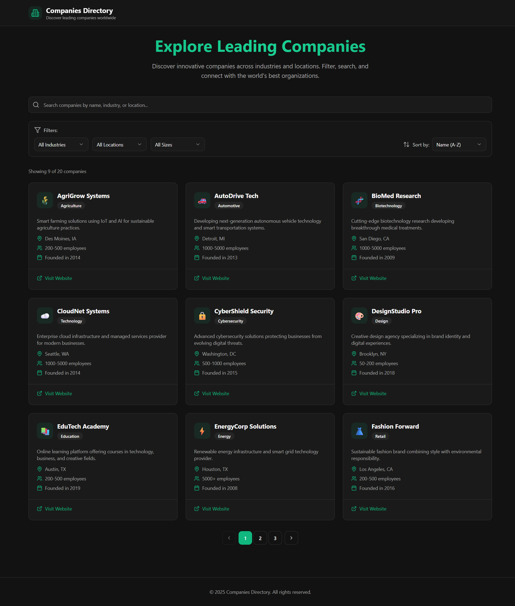
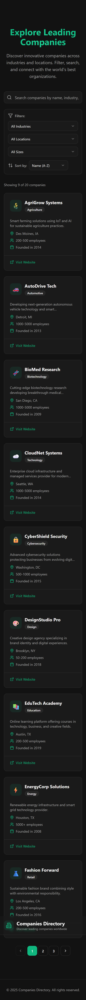

# 🏢 Companies Directory

A comprehensive, modern web application for discovering and exploring leading companies worldwide. Built with React and modern web technologies, this directory helps users find companies by industry, location, size, and other criteria.

## 📋 Table of Contents

- [Overview](#overview)
- [Features](#features)
- [Live Demo](#live-demo)
- [Screenshots](#screenshots)
- [Technologies Used](#technologies-used)
- [Getting Started](#getting-started)
- [Project Structure](#project-structure)
- [Usage Guide](#usage-guide)
- [API Reference](#api-reference)
- [Deployment](#deployment)
- [Contributing](#contributing)
- [License](#license)

## 🌟 Overview

Companies Directory is a full-featured web application designed to help users discover and explore companies across various industries and locations. The application provides an intuitive interface for searching, filtering, and browsing company information with real-time updates and responsive design.

### Key Highlights

- **20+ Companies**: Pre-loaded with diverse companies across multiple industries
- **Advanced Search**: Real-time search across company names, industries, and locations
- **Smart Filtering**: Filter by industry, location, and company size
- **Responsive Design**: Optimized for desktop, tablet, and mobile devices
- **Modern UI/UX**: Clean, professional interface with smooth animations

## ✨ Features

### 🔍 **Search & Discovery**
- Real-time search across company names, industries, and descriptions
- Advanced filtering by industry, location, and company size
- Smart sorting options (name A-Z, name Z-A, oldest first, newest first)

### 📊 **Company Information**
- Detailed company profiles with logos, descriptions, and key metrics
- Industry categorization and location information
- Company size indicators and founding dates
- Direct website links for each company

### 🎨 **User Experience**
- Responsive grid layout that adapts to screen size
- Pagination for easy navigation through large datasets
- Loading states and smooth transitions
- Toast notifications for user feedback

### 🛠 **Technical Features**
- Client-side routing with React Router
- State management with React hooks
- Optimized performance with React Query
- Accessibility features with ARIA labels
- SEO-friendly meta tags and structure

## 🚀 Live Demo

[View Live Demo](https://companies-hub.netlify.app) *(Replace with actual deployment URL)*

## 📸 Screenshots

### Desktop View


### Mobile View



## 🛠 Technologies Used

### Frontend Framework
- **React 18** - Modern JavaScript library for building user interfaces
- **Vite** - Fast build tool and development server
- **JavaScript (ES6+)** - Modern JavaScript features

### UI/UX Libraries
- **shadcn/ui** - Beautiful and accessible component library
- **Tailwind CSS** - Utility-first CSS framework
- **Lucide React** - Beautiful & consistent icon toolkit
- **Radix UI** - Low-level UI primitives for accessibility

### Routing & State Management
- **React Router** - Client-side routing
- **React Query (TanStack Query)** - Data fetching and caching
- **React Hooks** - State management and side effects

### Development Tools
- **ESLint** - Code linting and quality assurance
- **PostCSS** - CSS processing and optimization
- **Autoprefixer** - CSS vendor prefixing

## 🚀 Getting Started

### Prerequisites

Before you begin, ensure you have the following installed:
- **Node.js** (v16.0.0 or higher)
- **npm** (v7.0.0 or higher) or **yarn** (v1.22.0 or higher)
- **Git** for version control

### Installation

1. **Clone the repository**
   ```bash
   git clone https://github.com/saicharan2043/companies-hub.git
   cd companies-directory
   ```

2. **Install dependencies**
   ```bash
   npm install
   # or
   yarn install
   ```

3. **Start the development server**
   ```bash
   npm run dev
   # or
   yarn dev
   ```

4. **Open your browser**
   Navigate to `http://localhost:8080` to view the application

### Alternative Installation Methods

#### Using Yarn
```bash
yarn install
yarn dev
```

#### Using pnpm
```bash
pnpm install
pnpm dev
```

## 📁 Project Structure

```
companies-directory/
├── public/                 # Static assets
│   ├── company-icon.png   # Company logo/favicon
│   └── robots.txt         # SEO robots file
├── src/                   # Source code
│   ├── components/        # Reusable components
│   │   ├── ui/           # shadcn/ui components
│   │   │   ├── badge.jsx
│   │   │   ├── button.jsx
│   │   │   ├── card.jsx
│   │   │   ├── input.jsx
│   │   │   ├── select.jsx
│   │   │   ├── toast.jsx
│   │   │   └── ...
│   │   ├── CompanyCard.jsx    # Individual company display
│   │   ├── CompanyGrid.jsx    # Grid layout component
│   │   ├── FilterPanel.jsx    # Filter controls
│   │   ├── Header.jsx         # Application header
│   │   ├── LoadingSpinner.jsx # Loading state component
│   │   ├── Pagination.jsx     # Pagination component
│   │   ├── SearchBar.jsx      # Search input component
│   │   └── SortControls.jsx   # Sorting controls
│   ├── data/              # Static data
│   │   └── companiesData.js   # Company data and filter options
│   ├── hooks/             # Custom React hooks
│   │   ├── use-mobile.jsx     # Mobile detection hook
│   │   └── use-toast.js       # Toast notification hook
│   ├── lib/               # Utility functions
│   │   └── utils.js           # Common utilities
│   ├── pages/             # Page components
│   │   ├── Index.jsx          # Main companies listing page
│   │   └── NotFound.jsx       # 404 error page
│   ├── App.jsx            # Main application component
│   ├── main.jsx           # Application entry point
│   └── index.css          # Global styles
├── index.html             # HTML template
├── package.json           # Dependencies and scripts
├── tailwind.config.js     # Tailwind CSS configuration
├── vite.config.js         # Vite configuration
├── jsconfig.json          # JavaScript configuration
└── README.md              # Project documentation
```

## 📖 Usage Guide

### Basic Usage

1. **Search Companies**
   - Use the search bar to find companies by name, industry, or location
   - Search is case-insensitive and works in real-time

2. **Filter Results**
   - Use the filter panel to narrow down results by:
     - Industry (Technology, Healthcare, Finance, etc.)
     - Location (San Francisco, New York, Boston, etc.)
     - Company Size (Small, Medium, Large)

3. **Sort Companies**
   - Sort companies by:
     - Name (A-Z or Z-A)
     - Founding Date (Oldest or Newest first)

4. **Navigate Results**
   - Use pagination to browse through multiple pages of results
   - Each page shows 9 companies for optimal viewing

### Advanced Features

- **Clear Filters**: Reset all filters with one click
- **Responsive Design**: Optimized for all screen sizes
- **Keyboard Navigation**: Full keyboard accessibility support
- **Loading States**: Smooth loading indicators during data processing

## 🔧 Available Scripts

| Script | Description |
|--------|-------------|
| `npm run dev` | Start development server with hot reload |
| `npm run build` | Build production-ready application |
| `npm run build:dev` | Build application in development mode |
| `npm run preview` | Preview production build locally |
| `npm run lint` | Run ESLint for code quality checks |

### Development Commands

```bash
# Start development server
npm run dev

# Build for production
npm run build

# Preview production build
npm run preview

# Run linting
npm run lint
```

## 🌐 Deployment

### Build for Production

1. **Create production build**
   ```bash
   npm run build
   ```

2. **Preview locally**
   ```bash
   npm run preview
   ```

3. **Deploy to hosting platform**
   - Upload the `dist` folder contents to your hosting provider
   - Configure your server to serve the `index.html` file for all routes

### Deployment Platforms

#### Vercel
```bash
npm install -g vercel
vercel --prod
```

#### Netlify
```bash
npm install -g netlify-cli
netlify deploy --prod --dir=dist
```

#### GitHub Pages
1. Build the project: `npm run build`
2. Push the `dist` folder to a `gh-pages` branch
3. Configure GitHub Pages to serve from the `gh-pages` branch

### Environment Variables

No environment variables are required for this project as it uses static data.

## 🤝 Contributing

We welcome contributions! Please follow these steps:

1. **Fork the repository**
   ```bash
   git clone https://github.com/saicharan2043/companies-hub.git
   ```

2. **Create a feature branch**
   ```bash
   git checkout -b feature/amazing-feature
   ```

3. **Make your changes**
   - Write clean, readable code
   - Add comments for complex logic
   - Follow the existing code style

4. **Test your changes**
   ```bash
   npm run lint
   npm run build
   ```

5. **Commit your changes**
   ```bash
   git commit -m "Add amazing feature"
   ```

6. **Push to the branch**
   ```bash
   git push origin feature/amazing-feature
   ```

7. **Submit a Pull Request**
   - Describe your changes clearly
   - Include screenshots if applicable
   - Reference any related issues

### Development Guidelines

- Follow the existing code style and conventions
- Write meaningful commit messages
- Add tests for new features
- Update documentation as needed
- Ensure responsive design for all changes

## 📊 Data Structure

### Company Object
```javascript
{
  id: number,           // Unique identifier
  name: string,         // Company name
  industry: string,     // Industry category
  location: string,     // Company location
  size: string,         // Company size (Small/Medium/Large)
  founded: number,      // Year founded
  description: string,  // Company description
  logo: string,         // Company logo (emoji)
  website: string,      // Company website URL
  employees: string     // Employee count range
}
```

### Filter Options
```javascript
{
  industries: string[],    // Available industries
  locations: string[],     // Available locations
  companySizes: string[]   // Available company sizes
}
```

## 🐛 Troubleshooting

### Common Issues

1. **Port already in use**
   ```bash
   # Kill process on port 8080
   npx kill-port 8080
   ```

2. **Dependencies not installing**
   ```bash
   # Clear npm cache
   npm cache clean --force
   npm install
   ```

3. **Build errors**
   ```bash
   # Delete node_modules and reinstall
   rm -rf node_modules package-lock.json
   npm install
   ```

### Performance Optimization

- The application uses React Query for efficient data caching
- Components are optimized with React.memo where appropriate
- Images are optimized and lazy-loaded
- Bundle size is minimized with Vite's tree-shaking

## 📝 License

This project is licensed under the MIT License - see the [LICENSE](LICENSE) file for details.

## 🙏 Acknowledgments

- **shadcn/ui** for the beautiful component library
- **Tailwind CSS** for the utility-first CSS framework
- **Lucide** for the consistent icon set
- **React Query** for efficient data fetching
- **Vite** for the fast build tool

## 📞 Support

If you have any questions or need help:

- Create an [issue](https://github.com/saicharan2043/companies-hub.git/issues)
- Contact us at [your-email@example.com](mailto:saikirandonthulwar@gmail.com)

---

**Made with ❤️ by [Your Name](https://github.com/saicharan2043)**